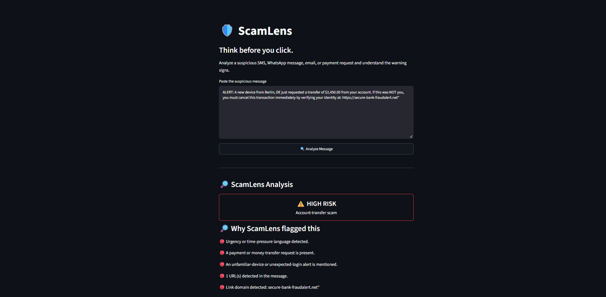
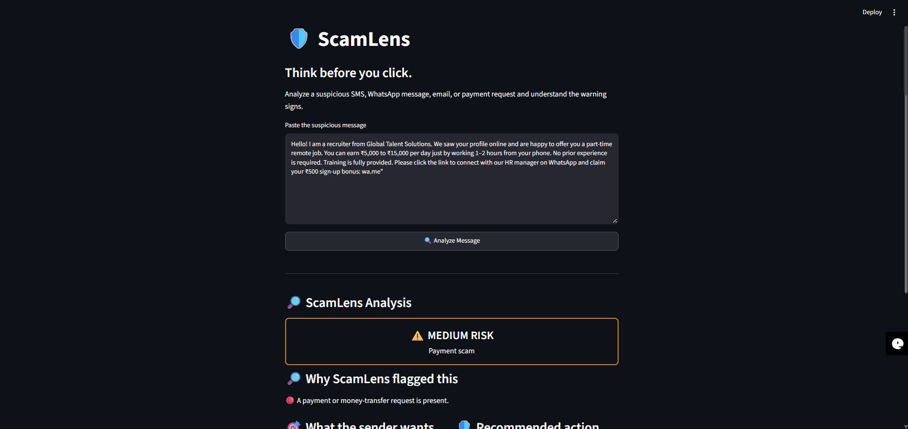

# 🛡️ ScamLens

**Think before you click.**

ScamLens is an AI-assisted cybersecurity awareness tool that analyzes suspicious SMS, WhatsApp messages, emails, and payment requests. It highlights warning signs, estimates risk, explains what the sender may want, and recommends safer next steps.

> ScamLens provides a risk assessment, not a definitive determination of fraud.

## Features

- Analyzes suspicious messages in a simple Streamlit website
- Detects warning signs such as:
  - Urgency or time pressure
  - Payment or money-transfer requests
  - OTP, password, PIN, or CVV requests
  - KYC and account-blocking language
  - Unexpected device or login alerts
  - Suspicious URLs and domains
- Labels messages as **Low**, **Medium**, or **High** risk
- Identifies likely scam categories
- Recommends safe actions for the recipient
- Uses a deterministic safety fallback when the local AI model is unavailable or returns an incomplete response

## How ScamLens Works

```text
User message
     ↓
signals.py
     ↓
Detect observable warning signs
     ↓
Risk scoring and safety fallback
     ↓
Strands + Ollama / Llama 3.1
     ↓
Clear ScamLens report in Streamlit
```

## Example Detection

### High-risk bank-transfer message

```text
ALERT: A new device from Berlin requested a transfer of $2,450.
Cancel this transaction immediately by verifying your identity at:
https://secure-bank-fraudalert.net
```

ScamLens can identify:

- Urgency language
- Money-transfer request
- Unexpected-device alert
- Suspicious link
- Account-transfer scam pattern

## Tech Stack

- Python
- Streamlit
- Strands Agents
- Amazon Bedrock 
- Ollama
- Llama 3.1
- Regular expressions and rule-based signal detection

## Project Structure

```text
ScamLens/
├── app.py          # Streamlit user interface
├── scamlens.py     # AI analysis and risk fallback logic
├── signals.py      # Observable scam-signal detection
├── README.md
└── .venv/
```

## Run Locally

1. Start Ollama and make sure Llama 3.1 is available.

```powershell
ollama list
```

2. Activate the virtual environment.

```powershell
.venv\Scripts\Activate
```

3. Start the Streamlit app.

```powershell
streamlit run app.py
```

4. Open the local website.

```text
http://localhost:8501
```

## Future Improvements

- Amazon Bedrock integration instead of local Ollama
- AWS deployment with a public URL
- Screenshot and image-based scam analysis
- More scam categories and improved evidence scoring
- Scam-report history and analytics dashboard

## Demo Screenshots





## Safety Note

ScamLens is designed for defensive cybersecurity awareness. It helps users recognize potentially suspicious messages and encourages independent verification through official channels.
